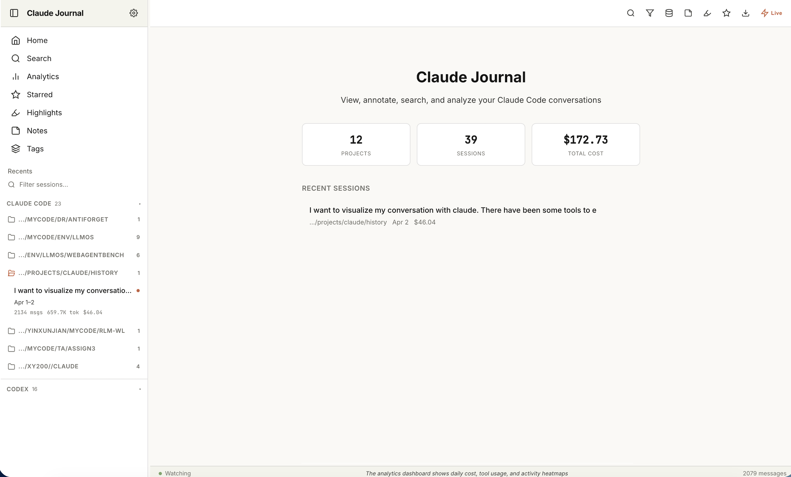
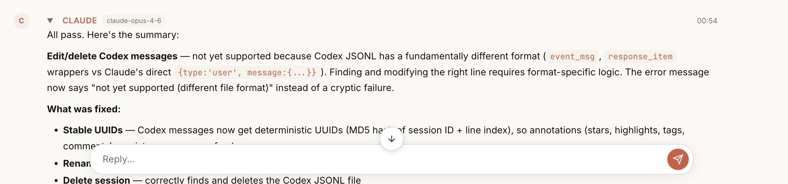
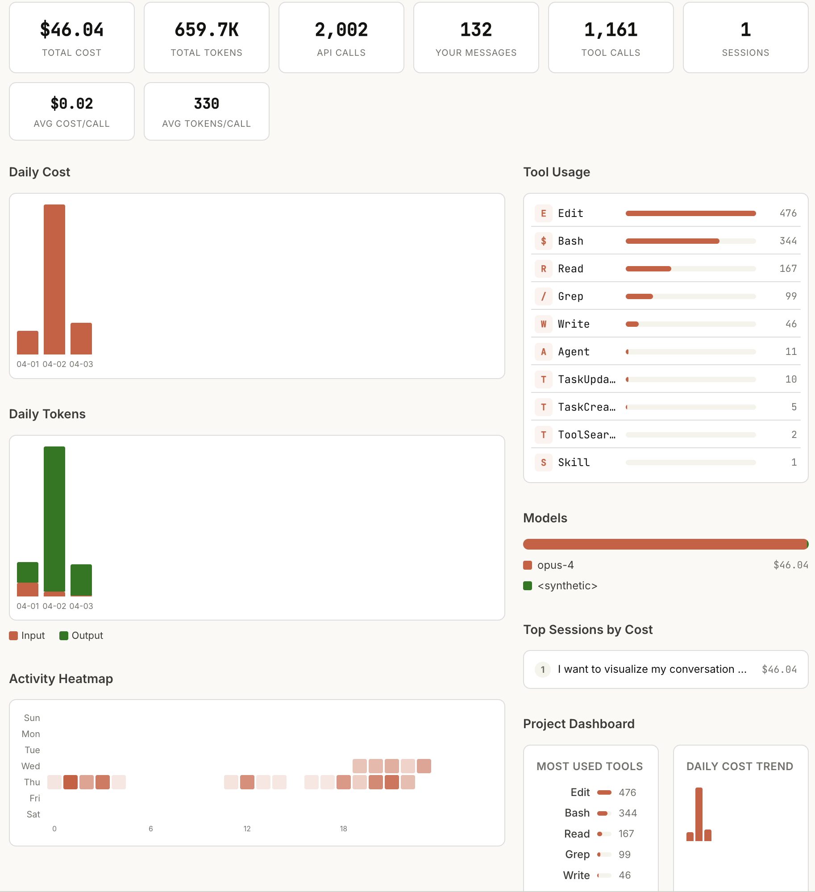

[English](README.md) | **中文** | [日本語](README.ja.md) | [한국어](README.ko.md) | [Español](README.es.md) | [Português](README.pt.md)

<p align="center">
  <h1 align="center">Claude Journal</h1>
  <p align="center">
    <strong>不只是查看器。与你的 AI 对话、编辑历史记录、管理每一段会话。</strong><br>
    <em>支持 Claude Code 和 OpenAI Codex。所有更改会直接写回真实文件。</em>
  </p>
  <p align="center">
    <a href="https://www.npmjs.com/package/claude-journal"></a>
    <a href="https://www.npmjs.com/package/claude-journal"></a>
    
    
  </p>
  <p align="center">
    <a href="https://arvid-pku.github.io/claude-journal/"><strong>交互式指南</strong></a> &middot;
    <a href="https://www.npmjs.com/package/claude-journal">npm</a> &middot;
    <a href="https://github.com/Arvid-pku/claude-journal/releases">版本发布</a>
  </p>
</p>

<p align="center">
  
</p>

## 快速开始

```bash
npm install -g claude-journal
claude-journal --daemon --port 5249
```

然后打开 [http://localhost:5249](http://localhost:5249)。它会自动检测你的 `~/.claude/projects` 和 `~/.codex/sessions` 目录。

重启电脑后，只需再次运行相同命令即可——无需重新安装。

---

## 这不只是一个查看器

大多数会话历史工具都是只读的。Claude Journal 与众不同：

### 直接在浏览器中对话

<p align="center">
  
</p>

在悬浮输入框中输入消息，Claude Code（或 Codex）会**恢复到完全相同的会话**——相同的会话、相同的上下文。响应通过实时文件监听以流式方式呈现。无需终端。

### 编辑你的真实历史记录

<p align="center">
  
</p>

每一处更改都会写回磁盘上的实际文件：

| 操作 | 具体效果 |
|--------|-------------|
| **重命名会话** | 将 `custom-title` 写入 JSONL 文件。`claude --resume "new-name"` 会立即生效。 |
| **编辑消息** | 更新 JSONL 文件中的消息内容。可以修改提示词、修正错别字、整理对话。 |
| **删除消息** | 从 JSONL 中移除对应行。永久删除该条历史消息。 |
| **复制会话** | 创建一个新的 JSONL 文件——完整副本，可用于实验。 |
| **移动会话** | 在项目目录之间移动 JSONL 文件（带有冲突检测）。 |

所有写入操作都是原子性的（临时文件 + 重命名）——即使 Claude Code 正在写入同一文件也是安全的。

---

## 功能特性

### 标注系统

为任意消息或会话添加星标、高亮（5 种颜色）、评论、标签和置顶。类似 Google Docs 的侧边评论，支持自动保存。可在侧边栏中浏览所有会话的标注（星标 / 高亮 / 笔记 / 标签）。标注数据独立存储——你的 JSONL 文件保持干净。

### 数据分析面板

<p align="center">
  
</p>

每日费用和 Token 图表、活跃度热力图、工具使用分布、模型分布、按费用排序的热门会话。支持按日期范围和项目筛选。同时支持 Claude Code 和 Codex。

### 智能展示

- **编辑操作的 Diff 视图** —— 红绿对比的统一 diff 视图，替代原始的新旧文本
- **工具调用折叠** —— 连续 3 个以上的工具调用折叠为摘要
- **会话时间线** —— 概览卡片显示首条提示、涉及的文件、工具使用条形图
- **代码复制按钮** —— 每个代码块一键复制
- **子代理展开** —— 内联查看嵌套的 Agent 对话
- **消息类型过滤** —— 切换显示用户消息、助手回复、工具调用、思考过程和特定工具类型
- **消息折叠** —— 点击标题即可折叠长消息

### 多供应商支持

Claude Code 和 OpenAI Codex 统一在同一界面中。侧边栏中的供应商分组可折叠。右键项目文件夹可置顶或隐藏。在设置中按供应商筛选。

### 会话管理

右键任意会话：置顶、重命名、复制、移动、删除、多选（批量删除）。右键项目文件夹：置顶、隐藏。

### 快捷键

按 `?` 查看完整列表。重点快捷键：`/` 搜索、`j/k` 导航、`Ctrl+E` 导出、`Ctrl+B` 侧边栏、`g+a` 数据分析。

### 导出

导出为 Markdown 或独立的 HTML 文件（内联 CSS，可分享给任何人）。

### 一切皆可配置

每个功能都可以在设置中禁用。偏好简洁的用户可以关闭头像、时间线、diff 视图、工具折叠、代码复制按钮、标签等。

---

## 安装

### 全局安装（推荐）

```bash
npm install -g claude-journal
claude-journal --daemon --port 5249
```

### 其他方式

```bash
npx claude-journal                          # 无需安装直接运行
claude-journal --daemon                     # 后台模式（默认端口 8086）
claude-journal --status                     # 检查状态：Running (PID 12345) at http://localhost:5249
claude-journal --stop                       # 停止守护进程
```

开机自动启动：
```bash
pm2 start claude-journal -- --daemon --no-open --port 5249
pm2 save && pm2 startup
```

### 桌面应用

从 GitHub Releases 下载 [AppImage / DMG / EXE](https://github.com/Arvid-pku/claude-journal/releases)。

> **macOS 用户：** 应用未经代码签名。macOS 会提示_"已损坏"_。解决方法：
> ```bash
> xattr -cr "/Applications/Claude Journal.app"
> ```

<details>
<summary>Docker / 从源码构建</summary>

```bash
# 从源码构建
git clone https://github.com/Arvid-pku/claude-journal.git
cd claude-journal && npm install && npm start

# Docker
docker build -t claude-journal .
docker run -v ~/.claude/projects:/data -p 5249:5249 -e PORT=5249 claude-journal
```
</details>

### 远程访问

```bash
# SSH 隧道（推荐）：
ssh -L 5249:localhost:5249 user@server

# 或使用认证进行直接访问：
claude-journal --daemon --auth user:pass --port 5249
```

VS Code Remote SSH 会自动转发端口——只需在终端中运行 `claude-journal` 即可。

---

## 架构

```
claude-journal/
  server.js                Express + WebSocket 服务器（聊天、标注、分析）
  bin/cli.js               CLI，支持守护进程模式，Node 18+ 检查
  providers/
    codex.js               Codex 供应商（读取 ~/.codex/，SQLite + JSONL）
  public/
    modules/               原生 JS ES 模块（无构建步骤）
      main.js              应用初始化、路由、聊天、快捷键
      messages.js           渲染、diff 视图、时间线、工具折叠、标签
      sidebar.js           会话列表、项目管理、批量操作
      analytics.js         图表、热力图、项目面板
      search.js            全局搜索与过滤
      state.js             共享状态、工具函数、diff 算法
  tray/                    Electron 系统托盘应用（可选）
  tests/                   Playwright 端到端测试
```

**无需构建步骤。** 纯原生 JS + ES 模块。没有 React，没有打包工具，没有转译器。

---

## 工作原理

1. **服务器** 扫描 `~/.claude/projects/` 和 `~/.codex/sessions/` 中的对话
2. **Codex 供应商** 将 Codex 事件（`function_call`、`reasoning` 等）标准化为 Claude 格式
3. **WebSocket** 监听活跃会话文件的实时更新，并将聊天消息传递给 `claude`/`codex` CLI
4. **标注数据** 独立存储在 `annotations/` 目录中——除非你主动编辑/删除，否则不会修改对话文件
5. **聊天** 以子进程方式启动 `claude --resume <id> --print` 或 `codex exec resume <id> --json`
6. **所有编辑** 使用原子写入，防止并发访问导致的数据损坏

---

## 已知限制和待改进

Claude Journal 是一个副项目，逐渐发展成了实用工具。目前还有一些粗糙之处：

| 限制 | 详情 |
|-----------|---------|
| **不支持 Codex 消息编辑** | Codex 的 JSONL 格式（`event_msg`/`response_item` 封装）与 Claude 不同。针对单条 Codex 消息的编辑/删除功能尚未实现。 |
| **费用估算为近似值** | 显示的是 API 等价费用（输入 + 输出 Token）。缓存 Token 不计入。实际计费取决于你的订阅方案。 |
| **无移动端布局** | 界面仅适配桌面端。侧边栏不适应小屏幕。 |
| **桌面应用未签名** | macOS 需要执行 `xattr -cr` 才能打开。正式代码签名需要 Apple 开发者证书（$99/年）。 |
| **仅支持单用户** | 没有用户账户，不支持多租户。专为个人本地使用设计。 |
| **编辑时实时更新偶有异常** | WebSocket 文件监听器可能在你操作消息时偶尔重建 DOM。 |

**欢迎贡献！** 如果你想帮助解决以上任何问题，请在 [github.com/Arvid-pku/claude-journal](https://github.com/Arvid-pku/claude-journal) 提交 issue 或 PR。

期望实现的功能：
- 移动端响应式布局
- Codex 消息编辑支持
- Apple 代码签名（.dmg）
- 更多供应商支持（Cursor、Windsurf、Aider 等）
- 会话对比（两段对话的并排 diff）
- 对话摘要（自动生成的会话总结）

---

## 系统要求

- **Node.js** 18 或更高版本
- **Claude Code**（`~/.claude/projects/`）和/或 **OpenAI Codex**（`~/.codex/sessions/`）

## 许可证

MIT

---

<p align="center">
  由 <a href="https://github.com/Arvid-pku">Xunjian Yin</a> 构建
</p>
